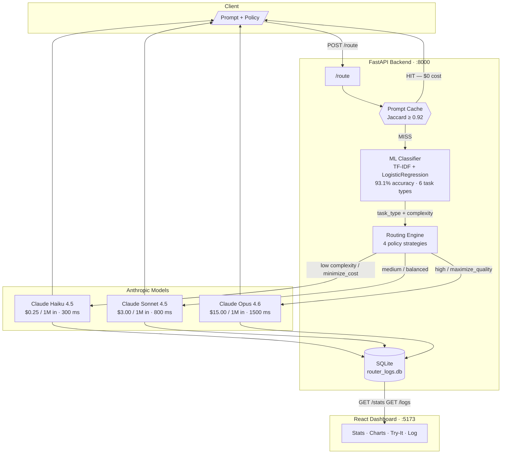

# llm-router

**Intelligent cost-optimizing router for Anthropic LLMs — classifies every prompt with a trained ML model, then picks the cheapest model that satisfies your quality, latency, and cost policy.**


> *Add your own screenshot after running the dashboard.*

---

## Architecture



---

## Features

| Feature | Detail |
|---|---|
| **ML prompt classification** | TF-IDF (1–2 gram) + LogisticRegression classifies prompts into 6 task types at 93.1% accuracy; Ridge regression predicts complexity 0–1 |
| **4 routing strategies** | `minimize_cost`, `maximize_quality`, `balanced` (complexity-aware), `minimize_latency` |
| **Hard policy constraints** | `quality_floor` and `max_cost_per_token` filter candidate models before the strategy is applied |
| **Fuzzy response cache** | In-memory LRU cache with word-level Jaccard similarity (threshold 0.92) — similar prompts share cached responses at zero cost |
| **Automatic fallback** | On API failure, escalates to the next higher-quality model and notes it in `routing_reasoning` |
| **Persistent SQLite logging** | Every request (cache hit or API call) is logged with full metadata; aggregate stats survive server restarts |
| **Real-time dashboard** | React + Recharts dashboard with live stats, pie/bar/line charts, a "Try It" panel, and a paginated request log |
| **Heuristic fallback** | Rule-based classifier (`?classifier=heuristic`) runs instantly with no model files required |

---

## Tech stack

| Layer | Technologies |
|---|---|
| **API** | Python 3.12, FastAPI, uvicorn, aiosqlite |
| **ML** | scikit-learn — TF-IDF, LogisticRegression, Ridge; joblib |
| **LLM provider** | Anthropic Python SDK (`anthropic >= 0.40`) |
| **Caching** | In-memory LRU with Jaccard similarity (pure Python, thread-safe) |
| **Persistence** | SQLite via `aiosqlite` (fully async, FastAPI-compatible) |
| **Dashboard** | React 18, Vite 5, Tailwind CSS 3, Recharts 2 |
| **Containerisation** | Docker, Docker Compose |

---

## Quick start

### Option 1 — Docker (one command)

```bash
git clone https://github.com/yourusername/llm-router.git
cd llm-router

cp .env.example .env
# Edit .env and set ANTHROPIC_API_KEY=sk-ant-...

docker-compose up
```

- **API + docs** → http://localhost:8000/docs
- **Dashboard**  → http://localhost:5173

---

### Option 2 — Manual

**1. Python environment**

```bash
python -m venv venv
source venv/bin/activate        # Windows: venv\Scripts\activate
pip install -r requirements.txt
cp .env.example .env            # then add your ANTHROPIC_API_KEY
```

**2. Train the ML classifier** *(optional — falls back to heuristic rules if skipped)*

```bash
# Generates ~800 labelled prompts via the Anthropic API (~5 min, ~$0.05)
python scripts/generate_dataset.py

# Trains TF-IDF + LogisticRegression/Ridge and saves to models/  (~30 s)
python scripts/train_classifier.py
```

**3. Start the API**

```bash
uvicorn app.main:app --reload --port 8000
```

**4. Start the dashboard** *(separate terminal)*

```bash
cd frontend
npm install
npm run dev
# → http://localhost:5173
```

---

## API reference

### `POST /route`

Classify the prompt, select the optimal model, call it, and return the response with full cost and routing metadata.

**Query params**

| Param | Values | Default |
|---|---|---|
| `classifier` | `ml` · `heuristic` | `ml` |

**Request body**
```json
{
  "prompt": "Write a Python implementation of quicksort with unit tests.",
  "policy": {
    "strategy": "balanced",
    "quality_floor": 0.0,
    "max_cost_per_token": null
  },
  "max_tokens": 1024,
  "system_prompt": null
}
```

**Strategies**

| Strategy | Behaviour |
|---|---|
| `minimize_cost` | Cheapest model above `quality_floor` |
| `maximize_quality` | Highest-quality model below `max_cost_per_token` |
| `balanced` | Complexity-weighted quality/cost tradeoff (default) |
| `minimize_latency` | Fastest model above `quality_floor` |

**Response**
```json
{
  "response_text": "...",
  "model_used": "claude-sonnet-4-5-20250929",
  "task_type": "code_generation",
  "complexity_score": 0.41,
  "input_tokens": 18,
  "output_tokens": 312,
  "cost_usd": 0.004842,
  "latency_ms": 3241.0,
  "routing_reasoning": "balanced strategy: medium-complexity task (complexity=0.41, task=code_generation). Selected Claude Sonnet 4.5 as the best quality-cost trade-off.",
  "cache_hit": false
}
```

---

### `GET /stats`

Aggregate metrics from the SQLite log — persists across server restarts.

```json
{
  "total_requests": 42,
  "api_calls": 38,
  "cache_hits": 4,
  "cache_hit_rate": 0.0952,
  "total_cost_usd": 0.8241,
  "hypothetical_opus_cost_usd": 3.1190,
  "cost_savings_usd": 2.2949,
  "cost_savings_pct": 73.58,
  "average_latency_ms": 2840.3,
  "requests_per_model": {}
}
```

---

### `GET /logs`

Paginated request log with an aggregated summary block.

| Param | Default | Description |
|---|---|---|
| `limit` | 50 | Rows per page (max 500) |
| `offset` | 0 | Pagination offset |
| `task_type` | — | Filter by task type |
| `model` | — | Filter by `model_selected` |
| `since` | — | ISO-8601 lower bound for `timestamp` |

---

### `GET /models` · `GET /health`

`/models` returns all registered models with pricing and capability metadata.
`/health` returns `{"status": "ok", "api_key_configured": true}`.

---

## How routing works

```
1. CACHE CHECK
   Normalise prompt → compute Jaccard similarity against all cached keys
   Match found (similarity ≥ 0.92, same policy) → return cached response, cost = $0

2. CLASSIFY  (< 1 ms)
   TF-IDF vectorise → LogisticRegression → task_type  (6 classes, 93.1% accuracy)
   TF-IDF vectorise → Ridge regression  → complexity  (0.0 – 1.0)

3. FILTER CANDIDATES
   Exclude models below quality_floor
   Exclude models above max_cost_per_token  (if set)

4. APPLY STRATEGY
   minimize_cost    → cheapest surviving candidate
   maximize_quality → highest quality_score
   minimize_latency → lowest avg_latency_ms
   balanced         → complexity < 0.30  → prefer Haiku
                      0.30 – 0.65        → prefer Sonnet
                      > 0.65             → prefer Opus
                      score = (0.3 + 0.7·complexity)·quality + cost_efficiency·(1 - weight)

5. CALL + FALLBACK
   Call selected model; on RateLimit/APIError escalate to next-higher-quality model
   Log full row to SQLite (timestamp, cost, tokens, task, classifier, policy, cache_hit)
   Cache the response for future similar prompts
```

---

## Cost savings

Results from a representative 5-prompt test run:

| Prompt | Strategy | Model selected | Actual cost | Opus baseline | Savings |
|---|---|---|---|---|---|
| "What is the capital of France?" | minimize_cost | Haiku 4.5 | $0.000016 | $0.000960 | **98.3%** |
| Write Python merge-sort with tests | balanced | Sonnet 4.5 | $0.011364 | $0.056820 | **80.0%** |
| Prove the Basel problem (π²/6) | maximize_quality | Opus 4.6 | $0.100455 | $0.100455 | 0% ✓ |
| Summarise LLM passage in 3 bullets | minimize_cost | Haiku 4.5 | $0.000226 | $0.013575 | **98.3%** |
| Write a 200-word astronaut story | balanced | Sonnet 4.5 | $0.004323 | $0.021615 | **80.0%** |
| **Total** | | | **$0.116** | **$0.193** | **39.8%** |

The math proof correctly uses Opus because the policy was `maximize_quality` — the router respects the constraint rather than saving money at the cost of quality.

---

## Future improvements

- **Multi-provider support** — extend `providers/` with OpenAI, Gemini, and Mistral adapters with unified cost normalisation
- **Online learning** — collect implicit feedback signals and retrain the classifier periodically on real traffic
- **A/B testing framework** — split traffic between routing strategies and measure quality/cost outcomes statistically
- **Streaming responses** — `POST /route/stream` with server-sent events for low-latency UX on long completions
- **Prompt compression** — detect verbose prompts and offer a compressed version to reduce input token cost
- **Per-tenant budgets** — enforce per-user or per-team cost caps at the router level
- **Observability** — OpenTelemetry traces exported to Jaeger/Grafana for production monitoring
